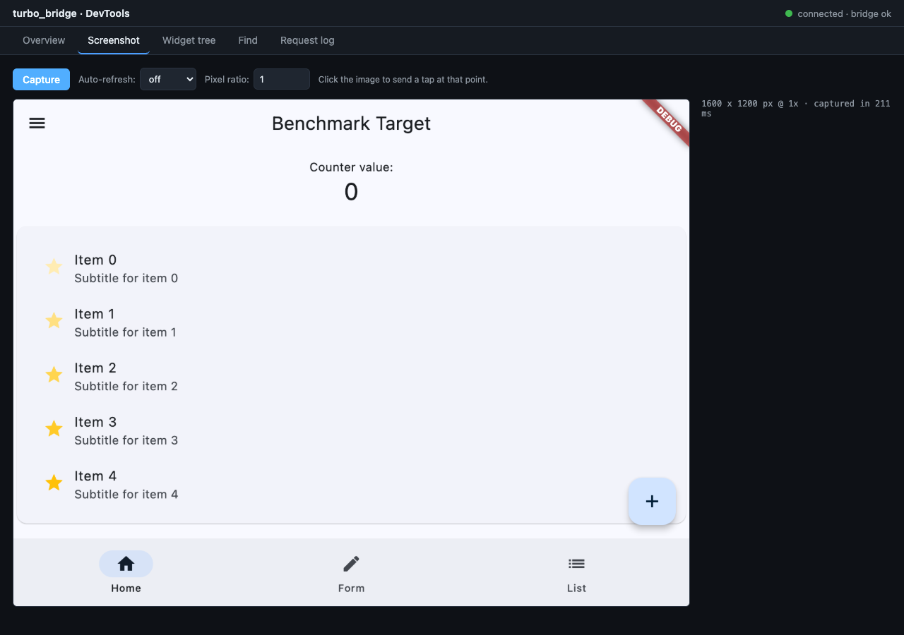
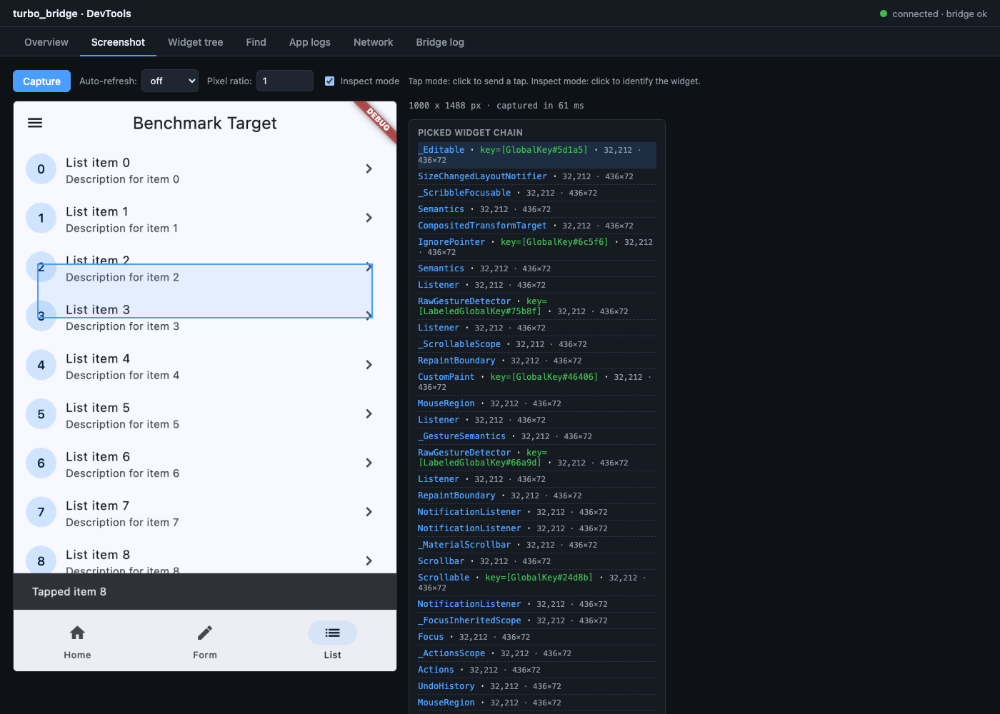
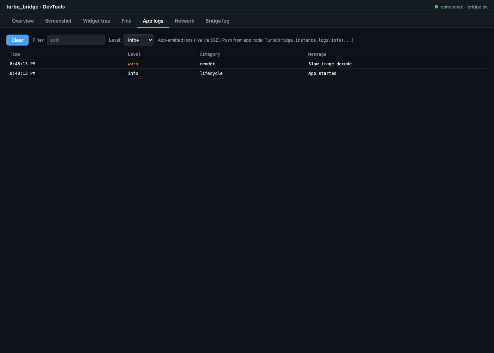
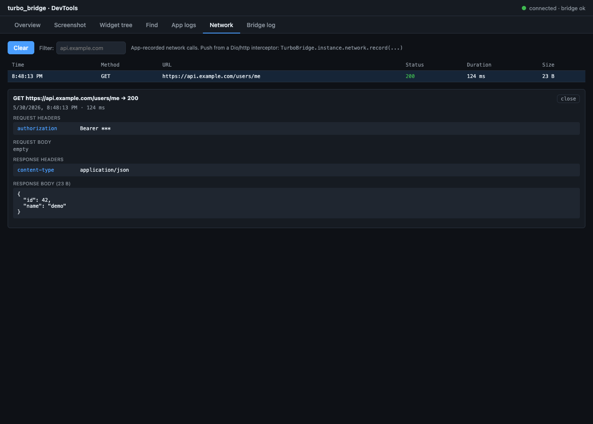
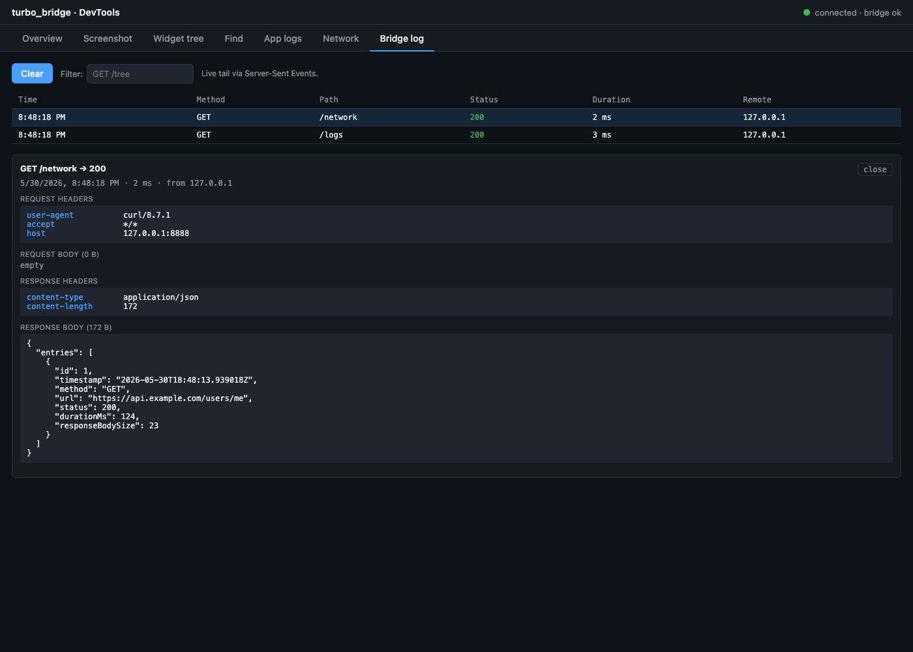

# turbo_bridge

In-app companion server for Flutter that enables AI agents and external tools to interact with your running app at native speed.

Drop it into any Flutter app to expose HTTP endpoints for screenshots, widget tree inspection, gesture injection, and app metadata — all without touching your app's code.

## Installation

Prefer the CLI so Flutter resolves the latest published version:

```bash
flutter pub add turbo_bridge
```

If your app uses FVM, run `fvm flutter pub add turbo_bridge` instead.

If you edit `pubspec.yaml` manually, use the latest version listed on pub.dev for `turbo_bridge`.

## Usage

```dart
import 'dart:async';

import 'package:flutter/foundation.dart';
import 'package:turbo_bridge/turbo_bridge.dart';

void main() {
  runApp(const MyApp());

  if (!kReleaseMode) {
    unawaited(TurboBridge.start(ensureInitialized: false));
  }
}
```

Only enable the bridge in non-release builds unless you explicitly want it reachable in production.

With custom configuration:

```dart
TurboBridge.start(
  config: BridgeConfig(
    port: 9000,
    host: '0.0.0.0',        // Allow remote connections
    defaultTreeDepth: 20,
    includeTimingHeaders: true,
  ),
);
```

## HTTP API

Once running, the bridge exposes these endpoints:

### `GET /screenshot`

Captures the current frame as PNG bytes.

| Parameter | Default | Description |
|-----------|---------|-------------|
| `pixelRatio` | `1.0` | Device pixel ratio for the capture |

**Response**: Raw PNG bytes with headers:
- `content-type: image/png`
- `x-capture-time-ms: 12`
- `x-image-width: 1170`
- `x-image-height: 2532`

### `GET /tree`

Returns the widget tree as JSON.

| Parameter | Default | Description |
|-----------|---------|-------------|
| `depth` | `10` | Max tree depth |
| `compact` | `true` | Omit framework-internal widgets |
| `x` | — | Optional focus X coordinate in logical pixels |
| `y` | — | Optional focus Y coordinate in logical pixels |
| `ancestorLevels` | `2` | Ancestors to keep above the focused hit node |

The tree response strips the framework shell wrappers above the app and, when `x`/`y` are provided, returns a smaller local subtree around the deepest widget hit at that coordinate.

**Response**: JSON with the widget tree structure including widget types, keys, text content, and layout bounds.

```json
{
  "captureTimeMs": 12,
  "focusPoint": {"x": 220.6, "y": 473.0},
  "ancestorLevels": 2,
  "rootWidget": {
    "type": "Column",
    "children": [
      {
        "type": "Text",
        "text": "Open duties"
      }
    ]
  }
}
```

### `POST /tap`

Injects a tap gesture at the given coordinates.

**Body** (JSON):
```json
{ "x": 195.0, "y": 422.0 }
```

**Response**:
```json
{ "success": true, "executionTimeMs": 3 }
```

### `GET /info`

Returns app metadata.

**Response**:
```json
{
  "screenWidth": 390.0,
  "screenHeight": 844.0,
  "pixelRatio": 3.0,
  "platform": "macos",
  "darkMode": false,
  "bridgeVersion": "0.1.4"
}
```

### `GET /health`

Health check endpoint. Returns `200 OK` when the server is running.

### `POST /swipe`

Injects a swipe gesture between two points.

**Body** (JSON):
```json
{ "startX": 200, "startY": 600, "endX": 200, "endY": 200, "steps": 10 }
```

**Response**:
```json
{ "success": true, "executionTimeMs": 5 }
```

### `POST /scroll`

Injects a scroll gesture at the given position.

**Body** (JSON):
```json
{ "x": 200, "y": 400, "dx": 0, "dy": -200, "steps": 5 }
```

**Response**:
```json
{ "success": true, "executionTimeMs": 3 }
```

### `POST /input`

Injects text into the currently focused text field.

**Body** (JSON):
```json
{ "text": "hello@example.com", "replace": true }
```

**Response**:
```json
{ "success": true, "executionTimeMs": 1 }
```

### `GET /pick?x=&y=` or `POST /pick`

Hit-tests the widget tree at the given screen point and returns the chain
of widgets from the root down to the most-specific match. Used by the
DevTools inspector to identify what's under a click on the screenshot.

**Response**:
```json
{
  "chain": [
    { "type": "MaterialApp" },
    { "type": "Scaffold", "rect": { "x": 0, "y": 0, "w": 800, "h": 600 } },
    { "type": "FloatingActionButton", "key": "increment_button",
      "rect": { "x": 720, "y": 520, "w": 56, "h": 56 } }
  ]
}
```

### `GET /logs?limit=&level=`

Returns recent app-emitted log lines that the app has pushed into
`TurboBridge.instance.logs`. Filter `level` by `trace`/`debug`/`info`/
`warn`/`error` (minimum severity).

### `GET /network?limit=`

Returns recent network calls that the app has pushed into
`TurboBridge.instance.network` from its HTTP interceptors.

### `GET /find` or `POST /find`

Finds widgets by text, key, or type. Returns ranked matches biased toward the visible, tappable UI on the current screen.

**Parameters** (query params or JSON body):
- `text` — Find by text content (substring match, case-insensitive)
- `key` — Find by ValueKey
- `type` — Find by widget type name
- `limit` — Max results (default 10)
- `visibleOnly` — Restrict results to matches that intersect the visible viewport (default `true`)
- `currentRouteOnly` — Restrict results to the current top route when possible (default `false`)
- `interactiveOnly` — Restrict results to widgets with an interactive tap target (default `false`)
- `nearX` / `nearY` — Optional point used to bias ranking toward a region

By default the bridge prefers matches that are visible, on the active route, and inside a tappable ancestor.

**Response**:
```json
{
  "found": true,
  "count": 2,
  "results": [
    {
      "type": "Text",
      "text": "Submit",
      "center": { "x": 195.0, "y": 422.0 },
      "bounds": { "x": 100.0, "y": 400.0, "w": 190.0, "h": 44.0 },
      "matchedBy": "text-exact",
      "score": 1523.4,
      "isVisible": true,
      "isCurrentRoute": true,
      "routeName": "/client/reports",
      "tapTargetType": "ListTile",
      "tapTargetKey": "report_row_0"
    }
  ],
  "searchTimeMs": 2
}
```

## DevTools web UI

Turbo Bridge ships with an embedded browser-based DevTools that you can
open in any browser while the app is running. It's served on its own port
and is **off by default** — enable it via `BridgeConfig`:

```dart
TurboBridge.start(
  config: BridgeConfig(
    port: 8888,
    enableDevTools: true,
    devToolsPort: 8889,           // default
    devToolsHost: '127.0.0.1',    // default; set to '0.0.0.0' for LAN access
  ),
);
```

Open `http://localhost:8889/` in your browser. Never enable in a production
build — DevTools exposes the same mutating endpoints as the JSON API.

### Tabs

| Tab | Purpose |
|---|---|
| Overview | App info + health |
| Screenshot | Live capture, click-to-tap, inspector mode |
| Widget tree | Recursive collapsible view with filter |
| Find | Run `/find` queries from the UI |
| App logs | Logs the app pushes into `TurboBridge.instance.logs` |
| Network | Network calls the app pushes into `TurboBridge.instance.network` |
| Bridge log | Live tail of JSON-API requests with request/response detail |

### Screenshot tab — live preview, click-to-tap, inspect mode



In **tap mode** (default), clicking on the displayed image translates
browser pixels to the app's logical coordinate space and sends `POST /tap`.
After a successful tap the screenshot auto-refreshes so you see the result.

In **inspect mode** (toggle in the toolbar), clicking instead calls
`POST /pick` and renders a blue bounding-rect overlay on the image plus
a sidebar listing the widget chain. Click any entry in the chain to
highlight that ancestor.



### App logs

`TurboBridge.instance.logs` is a public sink your app code (or any package
you use) can push log lines into. The DevTools "App logs" tab live-tails
them via Server-Sent Events; the JSON-API `GET /logs` exposes them to MCP
hosts and any external tooling.

```dart
final bridge = TurboBridge.instance;
bridge.logs.info('User signed in', category: 'auth', data: {'userId': '123'});
bridge.logs.warn('Slow image decode', category: 'render');
bridge.logs.error('Refresh failed', category: 'api', error: e, stackTrace: st);
```



### Network

`TurboBridge.instance.network.record(...)` accepts a completed HTTP call
and surfaces it in the DevTools "Network" tab and over MCP. Wire it from
your Dio interceptor / `http` wrapper / GraphQL client:

```dart
// Example Dio interceptor sketch
dio.interceptors.add(InterceptorsWrapper(
  onResponse: (response, handler) {
    final sw = Stopwatch()..start();
    TurboBridge.instance.network.record(
      method: response.requestOptions.method,
      url: response.requestOptions.uri.toString(),
      status: response.statusCode,
      requestHeaders: Map<String, String>.from(response.requestOptions.headers),
      requestBody: response.requestOptions.data?.toString(),
      responseHeaders: response.headers.map.map((k, v) => MapEntry(k, v.join(', '))),
      responseBody: response.data?.toString(),
      durationMs: sw.elapsedMilliseconds,
    );
    handler.next(response);
  },
));
```

Clicking a row opens a detail panel with request/response headers and
pretty-printed JSON bodies. Bodies above 16 KB are truncated with a
warning marker.



### Bridge log

The JSON-API request log includes full request and response details
(headers + body excerpts) for every call the bridge served. Clicking a
row opens a detail panel — great for debugging exactly what your AI agent
or MCP host is sending.



### Security

- DevTools is off by default.
- Default bind host is `127.0.0.1`. Setting `devToolsHost: '0.0.0.0'`
  logs a warning at startup.
- Mutating endpoints on the DevTools port require the `x-turbo-devtools: 1`
  same-origin header — drive-by browser pages can't puppet your app.
- DevTools-port traffic does not appear in the Bridge log; only direct
  JSON-API calls do, so polling from the UI doesn't spam it.

## Architecture

The bridge runs an in-process HTTP server using [shelf](https://pub.dev/packages/shelf). All operations execute on the main isolate with direct access to Flutter's rendering pipeline — no IPC, no serialization overhead.

```
┌──────────────────────────────────────────────────────┐
│  Your Flutter App                                    │
│                                                      │
│  ┌────────────────────────────────────────────────┐  │
│  │  TurboBridge                                   │  │
│  │  ├── shelf HTTP server (:8888 — JSON API)      │  │
│  │  ├── DevTools server  (:8889 — optional)       │  │
│  │  ├── ScreenshotService (RenderView)            │  │
│  │  ├── WidgetTreeService (Element tree + pick)   │  │
│  │  ├── GestureService (tap/swipe/scroll)         │  │
│  │  ├── FindService (route-aware lookup)          │  │
│  │  ├── AppInfoService (MediaQuery)               │  │
│  │  ├── LogSink (app-pushed log lines)            │  │
│  │  └── NetworkLog (app-pushed HTTP activity)     │  │
│  └────────────────────────────────────────────────┘  │
└──────────────────────────────────────────────────────┘
```

## Performance

All operations target sub-20ms in-process latency:

| Operation | In-process (p95) |
|-----------|-----------------|
| Screenshot | <20ms |
| Widget tree | <15ms |
| Tap | <10ms |
| App info | <1ms |

## Testing

```dart
// Use createForTest to get an instance without starting the HTTP server
final bridge = TurboBridge.createForTest(
  config: const BridgeConfig(),
  screenshotService: mockScreenshot,
);
```

## When to Use

- **AI-assisted development** — Let LLMs see and interact with your app
- **Automated testing** — Drive your app from external test scripts
- **CI/CD visual regression** — Capture screenshots from running builds
- **Remote debugging** — Inspect widget trees from another machine

## Security Note

The bridge exposes full app interaction over HTTP. Only enable it in debug/profile builds or on trusted networks. Do not ship to production with the bridge active.
